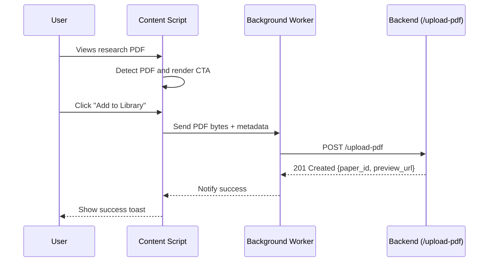

# Repository Guidelines

## Project Overview
Project: Zotero-style Chrome extension that collects, uploads, and organizes research PDFs. Backend relies on Supabase Auth (PKCE) plus a custom `/upload-pdf` API. PDF ingestion happens client-side, with background upload to the backend.

## Architecture Summary
The extension agents collaborate to handle authentication, PDF detection, user prompting, PDF fetching, and uploads. Tokens stay scoped to background agents, while content scripts manage discovery and UX.

## High-Level Flow
1. User signs in with Supabase Auth (PKCE via `launchWebAuthFlow`).
2. Content script detects a research PDF (direct link or embedded viewer).
3. Floating UI prompts “Add to my library?”.
4. On confirmation, content script fetches PDF bytes.
5. Background service worker uploads PDF and metadata to `/upload-pdf`.
6. Server validates input and returns `paper_id` plus preview URL.



## Agent Responsibilities
### Auth Agent (background)
- Implements Supabase PKCE OAuth2 via `launchWebAuthFlow`.
- Stores tokens in `chrome.storage.session`; refreshes as needed.
- Supplies `Authorization: Bearer <token>` headers during uploads.
- Inputs: `auth:login`, `auth:getSession`.
- Outputs: `auth:changed`, `auth:session`.

### PDF Detector Agent (content script)
- Detects research PDFs by URL suffix, embedded elements, or known domains (arXiv, ACM, IEEE, Springer).
- Outputs: `pdf:detected`, `ui:cta.show { title, authors, year, url }`.

### UI Agent (content script)
- Renders floating CTA and confirmation prompt.
- On accept, forwards metadata and triggers upload.
- Inputs: `ui:cta.show`.
- Outputs: `upload:request { url, metadata, project_id, paper_type }`.

### PDF Fetcher Agent (content script)
- Fetches PDF bytes via `fetch` or DOM extraction; handles CORS and viewer quirks.
- Inputs: `upload:request`.
- Outputs: `fetch:result { arrayBuffer, metadata }`, `fetch:error`.

### Upload Orchestrator Agent (background)
- Receives ArrayBuffer, builds `FormData`, attaches auth headers, and posts to `/upload-pdf`.
- Inputs: `fetch:result`, `auth:getSession`.
- Outputs: `upload:progress`, `upload:result { paper_id, preview_url }`, `upload:error { code, message }`.

### Library Sync Agent (background)
- Caches recent uploads and exposes `getRecentLibrary()` to popup/options.
- Outputs: `library:updated { paper_id, title }`.

### Settings Agent (popup/options)
- Displays auth status, default `project_id`, `paper_type`, and PDF detection toggles.

## Upload API Integration
`POST /upload-pdf`

| Field | Type | Description |
| --- | --- | --- |
| `file` | `application/pdf` blob | Must have MIME `application/pdf`; server rejects anything else. |
| `project_id` | `string` | Project identifier validated against the authenticated user. |
| `paper_type` | `"source" \| "candidate"` | Required for UX; validated but not persisted in the schema. |
| `metadata_json` | `string (JSON)` | Must parse into JSON with a non-empty `title`; other attributes are optional. |
| `Authorization` | `Bearer <Supabase JWT>` | Header consumed as `authorization`; used to resolve `user_id`. |

### Server Behavior
1. Confirm uploaded file reports `application/pdf` and that its bytes start with `%PDF`.
2. Parse the Supabase JWT to resolve `user_id`, then verify the supplied `project_id` belongs to that user.
3. Deserialize `metadata_json`; reject the request if `metadata.title` is empty.
4. Upload the PDF bytes to the `papers` storage bucket under `<user_id>/<project_id>/<uuid>.pdf` with a PDF content type.
5. Insert a `paper_attrs` record using the provided metadata, link it to the uploader via `priv_corpus`, and associate it with the project in `project_paper_links` (setting `has_paper = True`).
6. Generate a 24-hour signed preview URL via Supabase Storage and return it with the new `paper_id`.

### Response
```json
{
  "status": "success",
  "paper_id": "<uuid>",
  "preview_url": "<signed_url>"
}
```

## Permissions
```json
{
  "permissions": ["identity", "storage", "scripting"],
  "host_permissions": [
    "https://arxiv.org/*",
    "https://*.acm.org/*",
    "https://*.ieee.org/*"
  ],
  "background": { "service_worker": "background.js" },
  "content_scripts": [{
    "matches": ["<all_urls>"],
    "js": ["content.js"]
  }]
}
```

## Message Types
```ts
type PdfMetadata = {
  title: string;
  abstract?: string;
  authors?: string[];
  year?: number;
  month?: number;
  day?: number;
  doi?: string;
  category?: string;
  url?: string;
};

type UploadRequestMessage = {
  type: 'upload:request';
  payload: {
    url: string;
    project_id: string;
    paper_type: 'source' | 'candidate';
    metadata: PdfMetadata;
  };
};

type FetchResultMessage = {
  type: 'fetch:result';
  payload: {
    arrayBuffer: ArrayBuffer;
    metadata: PdfMetadata;
  };
};

type FetchErrorMessage = {
  type: 'fetch:error';
  payload: {
    reason: string;
    retryable: boolean;
  };
};

type UploadProgressMessage = {
  type: 'upload:progress';
  payload: {
    bytesUploaded: number;
    totalBytes?: number;
  };
};

type UploadResultMessage = {
  type: 'upload:result';
  payload: {
    paper_id: string;
    preview_url: string;
  };
};

type UploadErrorMessage = {
  type: 'upload:error';
  payload: {
    code: string;
    message: string;
  };
};

type LibraryUpdatedMessage = {
  type: 'library:updated';
  payload: {
    paper_id: string;
    title: string;
  };
};

type AuthSessionMessage = {
  type: 'auth:changed' | 'auth:session';
  payload: {
    access_token: string;
    refresh_token?: string;
    expires_at: number;
  } | null;
};

type AgentMessage =
  | UploadRequestMessage
  | FetchResultMessage
  | FetchErrorMessage
  | UploadProgressMessage
  | UploadResultMessage
  | UploadErrorMessage
  | LibraryUpdatedMessage
  | AuthSessionMessage;
```

## Security Notes
- All PDF bytes originate from the user’s browser session; content scripts never receive tokens.
- Upload endpoint insists on a valid Supabase JWT, verified `project_id`, `application/pdf` MIME type, `%PDF` header, and a non-empty `metadata.title`.

## Testing Checklist
- Supabase login via `launchWebAuthFlow`.
- Detect PDFs on arXiv and direct PDF links.
- Handle CORS during PDF fetch.
- POST `/upload-pdf` with the required form fields.
- Validate metadata contains `title`.
- Confirm preview URL returns HTTP 200.
- Verify local cache updates with the new `paper_id`.
